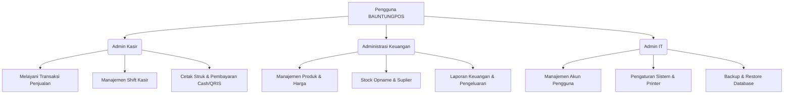

# DOKUMEN KEBUTUHAN FUNGSIONAL (FUNCTIONAL REQUIREMENTS DOCUMENT - FRD)
## PROYEK: BAUNTUNGPOS (Sistem Kasir & Manajemen Stok Toko Serba Ada)
### *REVISI 1: Penghapusan Barcode, Penyederhanaan Pembayaran, dan Pembaruan Identitas Toko*

---

## 1. PENDAHULUAN

### 1.1 Latar Belakang
**BAUNTUNGPOS** adalah aplikasi Point of Sale (POS) dan manajemen stok barang yang dirancang khusus untuk toko serba ada skala UMKM (Usaha Mikro, Kecil, dan Menengah). Sistem ini dirancang untuk berjalan dengan sangat ringan, cepat, dan mudah dioperasikan langsung melalui perangkat tablet Android (sebagai Progressive Web App / PWA), laptop, maupun komputer desktop. 

Dengan menyasar jenis usaha retail dengan perputaran barang yang cepat dan variasi item yang banyak, aplikasi ini harus responsif, ramah sentuhan (touch-friendly), serta mendukung operasional semi-offline ketika koneksi internet tidak stabil.

### 1.2 Tujuan Proyek
*   Menyediakan sistem kasir yang efisien untuk meminimalkan antrean di toko.
*   Mengotomatiskan pencatatan stok secara real-time dan memberikan peringatan dini untuk stok minimum.
*   Membantu pengelolaan keuangan toko secara transparan dan akurat.
*   Mendukung pencetakan struk belanja menggunakan printer thermal 58mm melalui koneksi Bluetooth/USB dengan protokol ESC/POS.

### 1.3 Target Pengguna & Vertikal Bisnis
*   **Toko Plastik & Sembako:** Penjualan grosir/eceran barang plastik (cup, kantong, box) dan barang kebutuhan pokok (beras, minyak, dll).
*   **Toko Kebersihan:** Penjualan perlengkapan rumah tangga/pembersih.
*   **Toko ATK (Alat Tulis Kantor):** Penjualan barang dengan varian jenis dan ukuran yang beragam.
*   **Toko Serba Ada / Minimarket Skala UMKM:** Kombinasi seluruh kebutuhan harian dengan jumlah item yang besar.

---

## 2. ARSITEKTUR & TEKNOLOGI

Aplikasi dibangun menggunakan teknologi modern yang memastikan performa tinggi dan kemudahan pemeliharaan:

| Komponen | Teknologi | Deskripsi / Peran |
| :--- | :--- | :--- |
| **Backend** | Laravel 12 (PHP 8.3+) | Framework backend tangguh dengan fitur Routing, ORM (Eloquent), Authentication, dan Restful API. |
| **Database** | MySQL 8+ | Penyimpanan data relasional transaksional yang mendukung indexing cepat dan ACID. |
| **Frontend** | Blade Template Engine + Tailwind CSS v4 | Pembuatan tampilan dinamis di server dengan styling modern, responsif, dan utility-first yang super ringan. |
| **Icon Library** | Heroicons 2.x | Set ikon SVG yang bersih dan konsisten untuk navigasi layar sentuh (tablet). |
| **PWA Engine** | Service Worker, Manifest, Offline Cache | Kemampuan instalasi langsung ke home screen Android tablet, pemuatan cepat (instant load), dan fallback offline cache. |
| **Printer Engine** | Bluetooth/USB ESC/POS Printer Driver | Integrasi cetak struk thermal 58mm menggunakan raw data perintah ESC/POS. |

---

## 3. PERAN PENGGUNA & HAK AKSES (USER ROLES & PERMISSIONS)

Aplikasi memiliki 3 (tiga) peran pengguna utama dengan batas otoritas yang terdefinisi dengan jelas untuk menjaga keamanan data toko:



### 3.1 Admin Kasir (Pelayanan Transaksi Toko)
Bertanggung jawab penuh atas operasional di meja kasir. Layar utama didesain khusus untuk tablet/layar sentuh dengan tombol yang besar dan alur cepat. 
*Contoh Kasir Terdaftar: **Jumiati** dan **Humairah**.*
*   **Hak Akses:**
    *   Membuka dan menutup shift kasir (input saldo awal/akhir laci kasir).
    *   Melakukan pencarian produk (berdasarkan ketik Kode Barang, nama produk, atau pilih kategori).
    *   Memasukkan barang ke keranjang belanja (cart) dan menyesuaikan kuantitas.
    *   Menerapkan diskon langsung pada item atau diskon transaksi (tergantung limitasi).
    *   Memproses pembayaran terbatas pada 2 metode: **Cash/Tunai** dan **QRIS**.
    *   Mencetak ulang struk transaksi terakhir.
    *   Menunda transaksi (Hold/Pending) dan memanggilnya kembali (Resume).
*   **Batasan:** Tidak dapat mengubah harga pokok barang, tidak dapat mengedit stok secara manual (kecuali melalui transaksi penjualan), tidak dapat melihat laporan profit toko, dan tidak dapat menghapus riwayat transaksi yang sudah difinalisasi tanpa persetujuan Admin Keuangan/IT.

### 3.2 Administrasi Keuangan (Manajer Toko & Keuangan)
Bertanggung jawab atas administrasi produk, stok, biaya operasional, dan analisis laba rugi.
*   **Hak Akses:**
    *   Mengelola master data produk (tambah, edit, nonaktifkan produk menggunakan pencatatan Kode Barang).
    *   Mengatur harga beli (modal) dan harga jual (eceran maupun grosir/multi-harga).
    *   Mengelola data supplier/pemasok.
    *   Melakukan Stock Opname (penyesuaian stok fisik dan sistem) beserta pencatatan alasan selisih.
    *   Mencatat biaya pengeluaran toko (biaya listrik, air, gaji karyawan, sewa, dan pengeluaran operasional lainnya).
    *   Melihat dashboard performa penjualan (Omset, COGS/HPP, Laba Kotor, Laba Bersih).
    *   Melihat laporan penjualan rinci per periode, per kasir (misal: memfilter kinerja Jumiati vs Humairah), per produk terlaris.
    *   Memantau log aktivitas pembukaan/penutupan shift kasir dan selisih uang kasir (cash variance).
*   **Batasan:** Tidak dapat mengubah konfigurasi sistem inti (seperti database credential, server setting, dll).

### 3.3 Admin IT (Pengelola Aplikasi / System Admin)
Bertanggung jawab atas kelancaran infrastruktur teknis, keamanan, konfigurasi perangkat keras, dan manajemen pengguna.
*   **Hak Akses:**
    *   Manajemen akun pengguna (tambah pengguna baru termasuk kasir baru, edit password, hapus/nonaktifkan pengguna, setel peran pengguna).
    *   Pengaturan profil toko (nama toko, alamat, nomor telepon, logo, NPWP, pesan footer struk).
    *   Konfigurasi printer thermal (tipe koneksi USB/Bluetooth, karakter set, lebar kertas, auto-cutter configuration).
    *   Manajemen backup database (unduh file sql cadangan) dan restore database jika terjadi kerusakan.
    *   Melihat log audit sistem (kapan user masuk, tindakan kritis apa saja yang dilakukan).
    *   Melakukan reset data transaksi (untuk inisialisasi awal toko baru).
*   **Batasan:** Tidak melakukan transaksi retail harian secara operasional kecuali untuk kebutuhan testing.

---

## 4. KEBUTUHAN FUNGSIONAL & MODUL APLIKASI

### 4.1 Modul Autentikasi & Akun
*   **REQ-001: Login Multi-Role**
    *   Pengguna dapat masuk ke sistem menggunakan kombinasi Username/Email dan Password.
    *   Sistem mengarahkan pengguna ke dashboard yang sesuai (Kasir diarahkan ke layar POS; Keuangan diarahkan ke Dashboard Keuangan; IT diarahkan ke Dashboard IT/User Management).
*   **REQ-002: Manajemen Sesi & Auto-Logout**
    *   Sesi kasir tetap aktif selama tablet digunakan (mencegah gangguan saat melayani antrean).
*   **REQ-003: Reset Password**
    *   Admin IT dapat mereset password pengguna lain. Pengguna mandiri dapat mengubah password mereka sendiri melalui menu profil.

### 4.2 Modul Point of Sale (POS) - Kasir
Layar ini dirancang dengan layout 2-kolom (Kolom kiri untuk pencarian/katalog produk, kolom kanan untuk keranjang belanja & detail pembayaran).

*   **REQ-004: Manajemen Shift (Mulai & Selesai Shift)**
    *   Sebelum melakukan penjualan, kasir (Jumiati/Humairah) wajib memasukkan jumlah uang tunai awal di laci kasir (laci modal).
    *   Saat shift ditutup, kasir memasukkan jumlah uang tunai akhir di laci. Sistem menghitung selisih (Variance) antara perhitungan sistem vs fisik tunai. Laporan shift dicetak ke printer thermal.
*   **REQ-005: Pencarian Produk Cepat**
    *   **Pencarian Kode Barang:** Kasir dapat mencari produk secara cepat dengan mengetikkan "Kode Barang" unik produk tersebut pada kolom input khusus. Menekan tombol Enter atau tombol Tambah akan langsung memasukkan item ke keranjang belanja.
    *   Pencarian teks real-time berbasis nama barang, kategori, atau Kode Barang.
    *   Grid katalog produk dengan filter kategori yang ramah sentuhan (touch-friendly).
*   **REQ-006: Keranjang Belanja (Cart Management)**
    *   Menampilkan daftar barang belanjaan saat ini: nama barang, Kode Barang, harga satuan, jumlah (quantity), diskon item, dan subtotal.
    *   Tombol tambah (+) dan kurang (-) berukuran besar untuk memudahkan pengaturan kuantitas pada tablet.
    *   Fitur diskon per item (nominal rupiah atau persentase).
    *   Fitur hapus barang dari cart dengan sekali sentuh.
*   **REQ-007: Pending & Resume Transaksi (Hold Cart)**
    *   Kasir dapat menyimpan sementara transaksi berjalan dan melayani pelanggan berikutnya.
    *   Kasir dapat memanggil kembali keranjang belanja yang ditangguhkan tersebut untuk diselesaikan.
*   **REQ-008: Pembayaran Terbatas (Cash & QRIS)**
    *   Sistem hanya menyediakan dua metode pembayaran resmi:
        *   **Cash / Tunai:** Dilengkapi tombol cepat uang pas (Rp10.000, Rp20.000, Rp50.000, Rp100.000) dan perhitungan kembalian otomatis.
        *   **QRIS:** Menampilkan gambar QRIS statis toko di layar tablet kasir agar pelanggan dapat langsung men-scan menggunakan e-wallet/mobile banking. Kasir melakukan verifikasi pembayaran secara manual pada status transaksi.
    *   Validasi agar nominal pembayaran tunai tidak kurang dari total belanja.
*   **REQ-009: Integrasi Thermal Printer 58mm & Struk Toko**
    *   Setelah pembayaran berhasil, sistem secara otomatis (atau manual berdasarkan setting) mengirimkan data struk belanja ke printer thermal 58mm.
    *   Informasi Struk menggunakan format ESC/POS standar dan wajib menggunakan identitas toko:
        *   **Header Baris 1:** `BAUNTUNGPOS`
        *   **Header Baris 2:** `TOKO PLASTIK & SEMBAKO`
        *   **Alamat:** `Jl. Panglima Batur, Komet, Kec. Banjarbaru Utara, Kota Banjar Baru, Kalimantan Selatan 70714`
        *   **Telepon:** `081230100395`
        *   **Nama Kasir:** Menampilkan nama kasir yang bertugas saat transaksi (misal: `Jumiati` atau `Humairah`).

```
+------------------------------------+
|            BAUNTUNGPOS             |
|       TOKO PLASTIK & SEMBAKO       |
| Jl. Panglima Batur, Komet, Banjar- |
| baru Utara, Kota Banjar Baru, Kalsel|
|         Telp: 081230100395         |
+------------------------------------+
| Tgl: 14-06-2026 13:45 Kasir: Jumiati|
| Struk: TR-202606140029             |
+------------------------------------+
| [K-0021] Kantong Plastik PE        |
|                        2   24.000  |
| [K-0105] Minyak Goreng Kita 1L     |
|                        1   16.000  |
| [K-0004] Gula Pasir 1kg            |
|                        2   35.000  |
+------------------------------------+
| TOTAL                      75.000  |
| BAYAR (TUNAI)              80.000  |
| KEMBALI                     5.000  |
+------------------------------------+
| Terima kasih atas kunjungan Anda!  |
|   Barang yang sudah dibeli tidak   |
|     dapat ditukar/dikembalikan     |
+------------------------------------+
```

### 4.3 Modul Manajemen Stok & Inventaris (Untuk Admin Keuangan)
*   **REQ-010: Master Data Produk**
    *   Form tambah/edit produk dengan field: Kode Barang (Product Code), Nama Produk, Kategori, Satuan (pcs, kg, pack, dus, dll), Harga Beli (modal/COGS), Harga Jual Eceran, Harga Jual Grosir (opsional), Stok Minimum, Status Aktif/Nonaktif.
*   **REQ-011: Manajemen Kategori Produk**
    *   Pengelompokan barang untuk memudahkan pencarian di POS (misal: Plastik, Sembako, Kebersihan).
*   **REQ-012: Pencatatan Barang Masuk (Stok Masuk / Purchase Order)**
    *   Pencatatan barang masuk dari supplier dengan mencocokkan Kode Barang untuk menambah stok.
*   **REQ-013: Stock Opname (Penyesuaian Stok Fisik)**
    *   Modul untuk mencocokkan stok di sistem dengan stok riil di toko.
    *   Menghasilkan log penyesuaian: stok sebelum, stok sesudah, selisih, alasan penyesuaian, dan nama admin pemroses.
*   **REQ-014: Peringatan Stok Minimum (Low Stock Alert)**
    *   Sistem memberikan notifikasi visual pada dashboard jika kuantitas stok produk berada di bawah nilai "Stok Minimum".

### 4.4 Modul Keuangan & Operasional (Untuk Admin Keuangan)
*   **REQ-015: Pencatatan Pengeluaran (Expense Tracker)**
    *   Pencatatan pengeluaran non-stok (listrik, gaji kasir Jumiati & Humairah, uang sewa, operasional toko).
*   **REQ-016: Laporan Laba Rugi (Profit & Loss Statement)**
    *   Kalkulasi otomatis: Pendapatan Kotor (Omset), HPP (Harga Pokok Penjualan), Laba Kotor, Total Pengeluaran, dan Laba Bersih.
*   **REQ-017: Laporan Penjualan & Performa**
    *   Laporan penjualan detail per transaksi (nomor struk, kasir, metode pembayaran Cash/QRIS, total belanja, diskon).
    *   Filter laporan berdasarkan nama kasir untuk melihat total uang tunai yang harus dikumpulkan dari masing-masing kasir (rekonsiliasi terpisah).

### 4.5 Modul Manajemen Pengguna & Sistem (Untuk Admin IT)
*   **REQ-018: Pengelolaan Pengguna (User Management)**
    *   Mengatur hak akses dan kredensial akun kasir (seperti membuat user kasir untuk `Jumiati` dan `Humairah`), admin keuangan, dan admin IT.
*   **REQ-019: Pengaturan Aplikasi & Struk**
    *   Mengubah konfigurasi toko secara default sesuai dengan data toko Banjarbaru Utara.
*   **REQ-020: Backup & Restore Data**
    *   Sistem menyediakan satu tombol untuk mencadangkan database MySQL (export file SQL terkompresi).

### 4.6 Modul PWA & Kemampuan Offline (Offline Resilience)
*   **REQ-021: Installable PWA & Manifest**
    *   Aplikasi dapat diinstal langsung ke Home Screen tablet Android kasir.
*   **REQ-022: Service Worker & Asset Caching**
    *   Memastikan aplikasi tetap dapat diakses meskipun koneksi internet terputus.
*   **REQ-023: Cache Data Produk Lokal & Sinkronisasi Penjualan Offline**
    *   Daftar produk disimpan di penyimpanan lokal tablet (`IndexedDB`).
    *   Saat offline, kasir tetap dapat memproses penjualan dengan mencari menggunakan Kode Barang.
    *   Pembayaran offline dibatasi hanya menggunakan metode **Cash/Tunai**. Transaksi disimpan di antrean lokal dan akan disinkronisasikan otomatis ke server Laravel setelah sistem mendeteksi status `online`.

---

## 5. KEBUTUHAN NON-FUNGSIONAL (NON-FUNCTIONAL REQUIREMENTS)

### 5.1 Kinerja (Performance)
*   **Waktu Muat Halaman:** Pemuatan halaman POS < 1.5 detik.
*   **Pencarian Kode Barang:** Pencarian Kode Barang langsung menampilkan hasil dalam waktu < 100ms.

### 5.2 Keamanan (Security)
*   **Enkripsi Password:** Enkripsi password menggunakan `bcrypt`.
*   **Otorisasi Middleware:** Kasir hanya diperbolehkan mengakses layar kasir (POS), tidak memiliki akses ke keuangan dan manajemen IT.

### 5.3 Usability (Kemudahan Penggunaan)
*   **Desain Layar Tablet:** Layout optimal untuk landscape tablet 10 inci. Tombol input angka/tunai dan pencarian didesain dengan visual besar yang ramah jemari tangan (minimum 48px x 48px).

---

## 6. USULAN DESAIN SKEMA DATABASE (DATABASE SCHEMA)

### 6.1 Tabel `users`
```sql
CREATE TABLE users (
    id BIGINT UNSIGNED AUTO_INCREMENT PRIMARY KEY,
    name VARCHAR(255) NOT NULL,
    username VARCHAR(100) NOT NULL UNIQUE,
    email VARCHAR(255) NULL UNIQUE,
    password VARCHAR(255) NOT NULL,
    role ENUM('admin_kasir', 'keuangan', 'admin_it') NOT NULL,
    is_active TINYINT(1) DEFAULT 1,
    remember_token VARCHAR(100) NULL,
    created_at TIMESTAMP DEFAULT CURRENT_TIMESTAMP,
    updated_at TIMESTAMP DEFAULT CURRENT_TIMESTAMP ON UPDATE CURRENT_TIMESTAMP
);
-- Contoh Seed Data Pengguna:
-- INSERT INTO users (name, username, password, role) VALUES ('Jumiati', 'jumiati', '...', 'admin_kasir');
-- INSERT INTO users (name, username, password, role) VALUES ('Humairah', 'humairah', '...', 'admin_kasir');
```

### 6.2 Tabel `categories`
```sql
CREATE TABLE categories (
    id BIGINT UNSIGNED AUTO_INCREMENT PRIMARY KEY,
    name VARCHAR(100) NOT NULL UNIQUE,
    description TEXT NULL,
    created_at TIMESTAMP DEFAULT CURRENT_TIMESTAMP,
    updated_at TIMESTAMP DEFAULT CURRENT_TIMESTAMP ON UPDATE CURRENT_TIMESTAMP
);
```

### 6.3 Tabel `products`
```sql
CREATE TABLE products (
    id BIGINT UNSIGNED AUTO_INCREMENT PRIMARY KEY,
    category_id BIGINT UNSIGNED NOT NULL,
    product_code VARCHAR(100) NOT NULL UNIQUE, -- Menggantikan SKU/Barcode
    name VARCHAR(255) NOT NULL,
    unit VARCHAR(50) NOT NULL DEFAULT 'pcs', -- pcs, pack, kg, dus
    buy_price DECIMAL(15, 2) NOT NULL DEFAULT 0.00, -- Modal / COGS
    sell_price DECIMAL(15, 2) NOT NULL DEFAULT 0.00, -- Harga Jual Eceran
    wholesale_price DECIMAL(15, 2) NULL, -- Harga Jual Grosir
    wholesale_min_qty INT DEFAULT NULL, -- Min beli untuk grosir
    stock INT NOT NULL DEFAULT 0,
    min_stock INT NOT NULL DEFAULT 5, -- Batas aman stok minimum
    image_path VARCHAR(255) NULL,
    is_active TINYINT(1) DEFAULT 1,
    created_at TIMESTAMP DEFAULT CURRENT_TIMESTAMP,
    updated_at TIMESTAMP DEFAULT CURRENT_TIMESTAMP ON UPDATE CURRENT_TIMESTAMP,
    FOREIGN KEY (category_id) REFERENCES categories(id) ON DELETE RESTRICT
);
```

### 6.4 Tabel `shifts`
```sql
CREATE TABLE shifts (
    id BIGINT UNSIGNED AUTO_INCREMENT PRIMARY KEY,
    user_id BIGINT UNSIGNED NOT NULL,
    start_time TIMESTAMP NOT NULL,
    end_time TIMESTAMP NULL,
    starting_cash DECIMAL(15, 2) NOT NULL DEFAULT 0.00, -- Uang modal laci
    expected_cash DECIMAL(15, 2) NULL DEFAULT 0.00, -- Hitungan sistem (penjualan tunai + modal)
    actual_cash DECIMAL(15, 2) NULL DEFAULT 0.00, -- Hitungan fisik kasir
    variance DECIMAL(15, 2) NULL DEFAULT 0.00, -- Selisih
    status ENUM('open', 'closed') DEFAULT 'open',
    note TEXT NULL,
    created_at TIMESTAMP DEFAULT CURRENT_TIMESTAMP,
    updated_at TIMESTAMP DEFAULT CURRENT_TIMESTAMP ON UPDATE CURRENT_TIMESTAMP,
    FOREIGN KEY (user_id) REFERENCES users(id) ON DELETE RESTRICT
);
```

### 6.5 Tabel `transactions`
```sql
CREATE TABLE transactions (
    id BIGINT UNSIGNED AUTO_INCREMENT PRIMARY KEY,
    invoice_number VARCHAR(100) NOT NULL UNIQUE, -- Format: TR-YYYYMMDD-9999
    shift_id BIGINT UNSIGNED NOT NULL,
    user_id BIGINT UNSIGNED NOT NULL, -- Kasir yang melayani (Jumiati/Humairah)
    subtotal DECIMAL(15, 2) NOT NULL,
    discount DECIMAL(15, 2) DEFAULT 0.00,
    tax DECIMAL(15, 2) DEFAULT 0.00,
    grand_total DECIMAL(15, 2) NOT NULL,
    payment_method ENUM('cash', 'qris') NOT NULL, -- Disederhanakan menjadi cash dan qris saja
    amount_paid DECIMAL(15, 2) NOT NULL, -- Jumlah uang diserahkan (jika Cash)
    change_due DECIMAL(15, 2) NOT NULL DEFAULT 0.00, -- Kembalian (jika Cash)
    is_synced TINYINT(1) DEFAULT 1,
    created_at TIMESTAMP DEFAULT CURRENT_TIMESTAMP,
    updated_at TIMESTAMP DEFAULT CURRENT_TIMESTAMP ON UPDATE CURRENT_TIMESTAMP,
    FOREIGN KEY (shift_id) REFERENCES shifts(id) ON DELETE RESTRICT,
    FOREIGN KEY (user_id) REFERENCES users(id) ON DELETE RESTRICT
);
```

### 6.6 Tabel `transaction_details`
```sql
CREATE TABLE transaction_details (
    id BIGINT UNSIGNED AUTO_INCREMENT PRIMARY KEY,
    transaction_id BIGINT UNSIGNED NOT NULL,
    product_id BIGINT UNSIGNED NOT NULL,
    qty INT NOT NULL,
    buy_price DECIMAL(15, 2) NOT NULL, -- Rekaman modal saat itu
    sell_price DECIMAL(15, 2) NOT NULL, -- Rekaman harga jual saat itu
    discount_amount DECIMAL(15, 2) DEFAULT 0.00,
    subtotal DECIMAL(15, 2) NOT NULL,
    created_at TIMESTAMP DEFAULT CURRENT_TIMESTAMP,
    FOREIGN KEY (transaction_id) REFERENCES transactions(id) ON DELETE CASCADE,
    FOREIGN KEY (product_id) REFERENCES products(id) ON DELETE RESTRICT
);
```

### 6.7 Tabel `suppliers`
```sql
CREATE TABLE suppliers (
    id BIGINT UNSIGNED AUTO_INCREMENT PRIMARY KEY,
    name VARCHAR(255) NOT NULL,
    contact_name VARCHAR(100) NULL,
    phone VARCHAR(50) NULL,
    address TEXT NULL,
    created_at TIMESTAMP DEFAULT CURRENT_TIMESTAMP,
    updated_at TIMESTAMP DEFAULT CURRENT_TIMESTAMP ON UPDATE CURRENT_TIMESTAMP
);
```

### 6.8 Tabel `stock_logs`
```sql
CREATE TABLE stock_logs (
    id BIGINT UNSIGNED AUTO_INCREMENT PRIMARY KEY,
    product_id BIGINT UNSIGNED NOT NULL,
    reference_id BIGINT UNSIGNED NULL,
    type ENUM('sales', 'intake', 'adjustment_plus', 'adjustment_minus') NOT NULL,
    qty_change INT NOT NULL,
    current_stock INT NOT NULL,
    reason TEXT NULL,
    created_at TIMESTAMP DEFAULT CURRENT_TIMESTAMP,
    user_id BIGINT UNSIGNED NOT NULL,
    FOREIGN KEY (product_id) REFERENCES products(id) ON DELETE CASCADE,
    FOREIGN KEY (user_id) REFERENCES users(id) ON DELETE RESTRICT
);
```

### 6.9 Tabel `expenses`
```sql
CREATE TABLE expenses (
    id BIGINT UNSIGNED AUTO_INCREMENT PRIMARY KEY,
    category VARCHAR(100) NOT NULL, -- Listrik, Gaji, Sewa, dll
    amount DECIMAL(15, 2) NOT NULL,
    description TEXT NULL,
    expense_date DATE NOT NULL,
    attachment_path VARCHAR(255) NULL,
    created_at TIMESTAMP DEFAULT CURRENT_TIMESTAMP,
    user_id BIGINT UNSIGNED NOT NULL,
    FOREIGN KEY (user_id) REFERENCES users(id) ON DELETE RESTRICT
);
```

### 6.10 Tabel `settings`
```sql
CREATE TABLE settings (
    id BIGINT UNSIGNED AUTO_INCREMENT PRIMARY KEY,
    `key` VARCHAR(100) NOT NULL UNIQUE,
    `value` TEXT NULL,
    created_at TIMESTAMP DEFAULT CURRENT_TIMESTAMP,
    updated_at TIMESTAMP DEFAULT CURRENT_TIMESTAMP ON UPDATE CURRENT_TIMESTAMP
);
```

---

## 7. ALUR KERJA UTAMA (KEY WORKFLOWS)

### 7.1 Alur Transaksi Kasir (POS)
1.  **Mulai Shift:** Kasir (Jumiati/Humairah) membuka shift dan memasukkan modal awal laci.
2.  **Input Kode Barang / Nama:**
    *   Kasir mengetikkan **Kode Barang** (misal: `PL-001`) pada kolom pencarian cepat, kemudian sistem otomatis menambahkan item ke keranjang belanja.
    *   Atau kasir mengetik nama barang secara parsial, memilih dari daftar dropdown hasil pencarian, atau menyentuh tombol kategori di layar tablet.
3.  **Metode Pembayaran:**
    *   **Cash / Tunai:** Kasir mengetik jumlah uang tunai yang diberikan. Sistem menghitung kembalian.
    *   **QRIS:** Kasir menekan opsi "QRIS", layar tablet akan menampilkan QRIS statis toko. Kasir memverifikasi transaksi pembayaran dari HP/Mutasi atau secara visual dan menekan tombol konfirmasi sukses.
4.  **Cetak Struk:** Struk thermal 58mm dicetak secara otomatis berisi header nama toko: `BAUNTUNGPOS` dan `TOKO PLASTIK & SEMBAKO` dengan detail transaksi dan nama kasir yang melayani.

### 7.2 Alur Transaksi Offline (Koneksi Putus)
1.  **Deteksi Offline:** Panel POS menampilkan indikator "Offline Mode".
2.  **Operasional:** Kasir tetap memproses transaksi tunai dengan mengetik **Kode Barang** (membaca data lokal `IndexedDB`).
3.  **Pembatasan Pembayaran:** Hanya metode **Cash/Tunai** yang diperbolehkan ketika offline (QRIS dinonaktifkan sementara demi keamanan pencatatan).
4.  **Sinkronisasi:** Setelah internet tersambung kembali, seluruh transaksi terpending akan disinkronisasikan otomatis ke database server Laravel.
